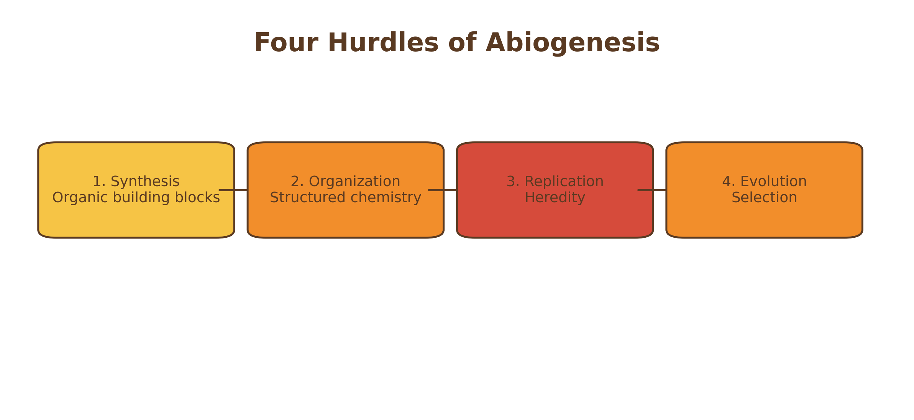
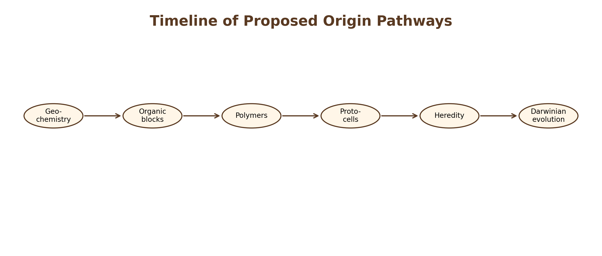

# Introduction

## Methodological Approach

This book evaluates each theory using a consistent analytical framework: explanatory scope, mechanistic plausibility, empirical support, unresolved gaps, and integrative potential. The goal is not to identify a single winning theory, but to assess which mechanisms are plausible, testable, and potentially compatible within broader hybrid models.

Figure \@ref(fig:four-hurdles) defines the four minimum hurdles any complete origin-of-life theory must overcome.

```{r four-hurdles, echo=FALSE, out.width='100%', fig.cap='Four major hurdles that any complete origin-of-life theory must address.'}

```

These four hurdles provide the evaluative structure used across all subsequent chapters.

Figure \@ref(fig:pathway-timeline) situates major theories within a broader transition from geochemistry to Darwinian evolution.

```{r pathway-timeline, echo=FALSE, out.width='100%', fig.cap='Simplified timeline showing where major origin-of-life theories may fit within a broader transition from geochemistry to biological evolution.'}

```

This staged view motivates the central comparative approach of the book: multiple theories may be sequentially compatible rather than mutually exclusive.
