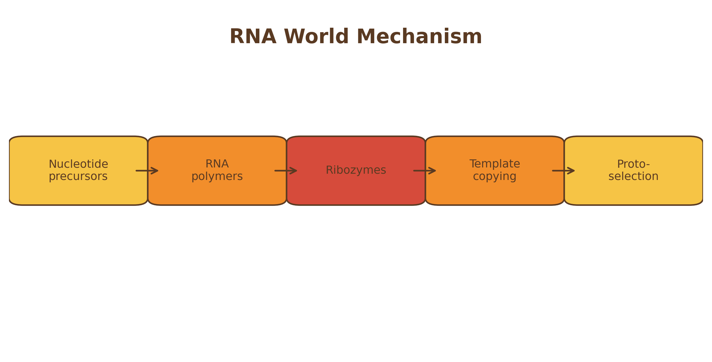

# RNA World Hypothesis

## Core Idea

The RNA World hypothesis proposes that RNA preceded DNA and proteins because it can store information and catalyze reactions [@gilbert1986].

## Historical Context

The term “RNA World” was formalized by Gilbert in 1986 [@gilbert1986], though its conceptual roots emerged from earlier work on ribozymes and molecular evolution.

## Mechanistic Basis

RNA is proposed as a dual-function molecule linking information storage, catalysis, and early selection.

Figure \@ref(fig:rna-world-mechanism) summarizes this logic.

```{r rna-world-mechanism, echo=FALSE, out.width='100%', fig.cap='Mechanistic logic of the RNA World hypothesis: RNA links information storage, catalysis, copying, and proto-selection.'}

```

The figure illustrates why RNA remains central to origin-of-life research.

## What the Theory Explains Well

RNA World is strongest at explaining heredity and pre-cellular molecular evolution.

## What Makes It Plausible

Ribozymes, RNA catalysis, and the ribosomal RNA core support the plausibility of ancient RNA-based systems [@joyce2002].

## Key Experimental / Observational Support

Catalytic ribozymes and in vitro RNA evolution strongly support the model [@joyce2002].

## Major Gaps and Critiques

The major gap is prebiotic accessibility: RNA is fragile and difficult to synthesize under realistic early Earth conditions.

## Current Scientific Standing

RNA World remains one of the most influential and central origin-of-life theories, though most current work treats it as incomplete without compartments or metabolic scaffolds (see Chapter \@ref(lipid-world)).

| Dimension | Assessment |
|---|---|
| Strength | Strong for heredity |
| Plausibility | Moderate–high |
| Main Gap | Prebiotic RNA synthesis |
| Current Standing | Central but incomplete |
