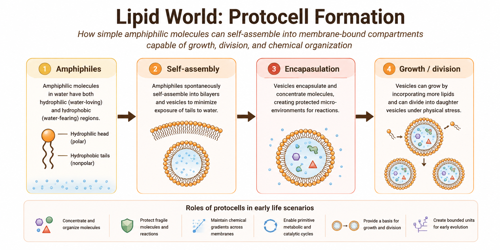

# Lipid World and Protocell Theories

## Chapter Overview

This chapter examines lipid world and protocell theories, which propose that membrane formation and compartmentalization were critical early steps in the emergence of life. Unlike theories that prioritize heredity or metabolism, lipid-based models emphasize the spontaneous self-assembly of amphiphilic molecules into membrane-bound structures capable of concentrating and organizing prebiotic chemistry.

The chapter reviews the historical development of lipid world theories, the physical chemistry underlying membrane self-assembly, experimental evidence for protocell formation, major criticisms, and the role of compartmentalization within broader hybrid models of abiogenesis.

## Key Terms

- Lipid world
- Protocells
- Vesicles
- Amphiphilic molecules
- Membrane self-assembly
- Compartmentalization
- Fatty acids
- Encapsulation
- Primitive membranes

## Core Idea

Lipid world and protocell theories propose that life may have emerged through the spontaneous formation of membrane-bound compartments capable of isolating and concentrating chemical reactions from the surrounding environment.

Certain organic molecules possess both hydrophilic and hydrophobic regions. In aqueous environments, these amphiphilic molecules naturally self-organize into structures such as micelles, bilayers, and vesicles. This self-assembly process can occur spontaneously under appropriate environmental conditions.

Within origin-of-life research, these membrane-bound structures are referred to as protocells because they resemble simplified precursors of modern biological cells.

Rather than beginning with heredity or metabolism alone, lipid world theories emphasize the importance of physical compartmentalization in stabilizing and organizing increasingly complex chemical systems [@deamer2012].

## Historical Context

Interest in membrane self-assembly emerged partly in response to limitations in earlier origin-of-life models. Primordial soup and metabolism-first theories explain aspects of chemical synthesis and organization but do not fully explain how fragile molecular systems could remain concentrated and protected within open environments.

Researchers such as David Deamer and others demonstrated that fatty acids and related amphiphilic molecules can spontaneously form membrane vesicles under plausible prebiotic conditions [@deamer2012].

These findings shifted attention toward the possibility that simple membranes may have appeared relatively early in Earth’s history and provided essential structural organization for subsequent biological evolution.

## Mechanistic Basis

Lipid world theories are grounded in the physical chemistry of self-assembly.

Amphiphilic molecules contain:
- Hydrophilic (“water-attracting”) regions
- Hydrophobic (“water-repelling”) regions

When placed in water, these molecules naturally arrange themselves into energetically favorable structures that minimize hydrophobic exposure. Depending on environmental conditions, this process can generate:

- Micelles
- Bilayer membranes
- Vesicles
- Membrane-bound protocells

These compartments may have provided several important advantages for early prebiotic systems:

- Concentration of molecules
- Protection from dilution
- Stabilization of reactions
- Encapsulation of catalysts
- Spatial organization of chemistry
- Primitive selective boundaries

Figure \@ref(fig:lipid-world-overview) summarizes the conceptual mechanism proposed by lipid world and protocell theories.

```{r lipid-world-overview, echo=FALSE, fig.align='center', out.width='100%', fig.cap='Conceptual mechanism of lipid world and protocell theories.'}

```

The figure illustrates how simple amphiphilic molecules may have spontaneously self-assembled into membrane-bound structures capable of concentrating and stabilizing increasingly complex prebiotic chemistry.

Unlike metabolism-first or RNA-centered theories, lipid world models primarily address the emergence of physical compartmentalization.

## Protocell Formation

Protocells represent one of the most important transitional concepts in origin-of-life research because they provide a possible bridge between chemistry and cellular organization.

Primitive protocells may have:
- Encapsulated organic molecules
- Concentrated catalytic reactions
- Maintained chemical gradients
- Protected fragile polymers
- Supported localized evolutionary processes

Some experimental studies demonstrate that fatty acid vesicles can:
- Grow by incorporating additional lipids
- Divide under physical stress
- Encapsulate nucleic acids
- Permit selective molecular transport

These behaviors resemble simplified versions of properties associated with living cells.

However, protocells remained chemically simple compared with modern biological cells and likely lacked sophisticated genetic control systems.

## Environmental Settings

Several environments may have supported protocell formation under early Earth conditions:

- Tidal pools
- Shoreline environments
- Volcanic ponds
- Hydrothermal regions
- Wet–dry cycling environments

Wet–dry cycles are considered particularly important because repeated evaporation and hydration may promote membrane formation, vesicle fusion, and molecular encapsulation.

Environmental fluctuations may therefore have played a major role in protocell dynamics and membrane evolution.

## What the Theory Explains Well

Lipid world theories are particularly strong at explaining:

- Compartment formation
- Molecular concentration
- Physical organization of chemistry
- Primitive selective boundaries
- Encapsulation of reactions
- Stabilization of prebiotic systems

Compartmentalization is considered essential because biological evolution requires organized systems capable of maintaining internal chemistry distinct from the surrounding environment.

Modern cells universally depend on membranes, suggesting that compartment formation was likely a critical transition during abiogenesis.

## What Makes It Plausible

Several observations support the plausibility of lipid world theories:

- Amphiphilic molecules self-assemble spontaneously in water
- Fatty acid vesicles form under experimentally realistic conditions
- Membranes can encapsulate nucleic acids and catalysts
- Vesicles can grow and divide under physical forces
- Membrane structures occur naturally in modern biology

These findings suggest that compartment formation may emerge naturally from basic physical and chemical principles.

## Key Experimental and Observational Support

Laboratory experiments demonstrate that fatty acids and related amphiphilic molecules readily form vesicles and bilayer membranes under plausible prebiotic conditions [@deamer2012].

Experimental protocells have also shown:
- Vesicle growth
- Membrane fusion
- Encapsulation of polymers
- Primitive transport behavior

Some studies suggest that mineral surfaces and wet–dry cycles may further enhance protocell formation and membrane stability.

Although these experiments do not recreate living cells, they strongly support the feasibility of spontaneous compartment formation.

## Major Gaps and Critiques

Despite their strengths, lipid world theories face several major limitations.

Most importantly, membrane formation alone does not explain:
- Heredity
- Replication
- Complex metabolism
- Information storage

Additional challenges include:
- Membrane instability under some environmental conditions
- Difficulty coordinating metabolism and heredity within protocells
- Limited catalytic capability of simple lipid systems
- Uncertainty regarding how protocells transitioned into fully living cells

For these reasons, protocell theories are generally viewed as necessary but incomplete components of abiogenesis.

## Integration with Other Theories

Lipid world theories integrate naturally with several other origin-of-life models.

Primitive membranes may have:
- Encapsulated RNA molecules
- Stabilized metabolic networks
- Maintained proton gradients
- Concentrated catalytic molecules
- Supported localized evolution

In many modern hybrid frameworks:
- Primordial synthesis produces organic molecules
- Metabolism-first models provide energy organization
- RNA World introduces heredity
- Lipid world theories provide compartmentalization

Together, these mechanisms may have contributed sequentially or simultaneously to the emergence of cellular life.

## Systems Perspective

Within the comparative framework of this book, lipid world theories primarily address the emergence of compartmentalization and cellular organization.

Their greatest strength lies in explaining how early chemistry may have become spatially organized and protected from environmental dilution.

However, these theories do not independently explain heredity or fully developed metabolism. Consequently, protocell models are best understood as one component within larger systems-level explanations of life’s emergence.

## Modern Relevance

Lipid world and protocell research remain highly active fields within:
- Origin-of-life studies
- Synthetic biology
- Systems chemistry
- Astrobiology

Artificial protocell experiments are increasingly used to investigate minimal requirements for cellular behavior and self-organization.

Because membrane self-assembly depends on universal physical principles, protocell formation may also be relevant to the search for extraterrestrial life.

## Current Scientific Standing

Lipid world and protocell theories remain influential components of modern abiogenesis research. Although they are rarely viewed as complete standalone explanations, they are widely considered essential for understanding how prebiotic chemistry may have become compartmentalized and increasingly cell-like.

Modern origin-of-life research increasingly integrates protocell formation with RNA-based heredity, geochemical energy systems, and environmental cycling mechanisms.

## Comparative Assessment

| Dimension | Assessment |
|---|---|
| Primary Contribution | Compartmentalization and protocell formation |
| Explanatory Strength | Strong for membrane organization |
| Mechanistic Plausibility | High |
| Experimental Support | Strong |
| Environmental Realism | Moderate to high |
| Main Limitation | Weak explanation for heredity and metabolism |
| Integrative Potential | Very high |
| Current Scientific Standing | Essential but incomplete component of abiogenesis models |

## Comparative Performance

| Question | Lipid World Performance |
|---|---|
| Produces organic building blocks? | Weak |
| Explains organized chemistry? | Moderate |
| Explains heredity? | Weak |
| Explains metabolism? | Weak–moderate |
| Explains compartment formation? | Strong |
| Supported experimentally? | Strong |
| Useful in hybrid models? | Very strong |