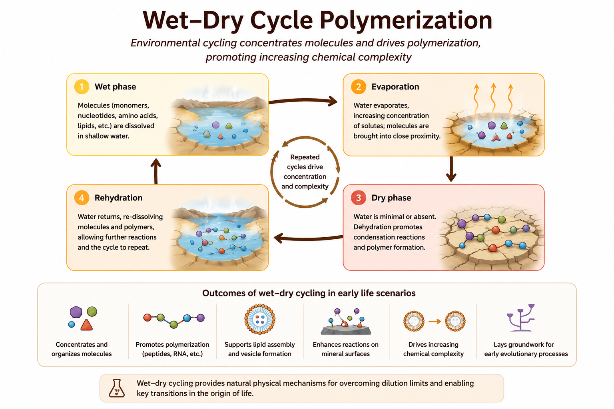

# Warm Little Pond and Wet–Dry Cycle Theories

## Chapter Overview

This chapter examines warm little pond and wet–dry cycle theories, which propose that fluctuating environmental conditions on early Earth may have promoted the concentration, polymerization, and organization of prebiotic molecules.

Unlike models centered primarily on heredity or metabolism, wet–dry cycle theories emphasize the importance of environmental cycling. Repeated hydration and dehydration may have provided natural physical mechanisms capable of concentrating dilute molecules, driving condensation reactions, and promoting increasingly complex prebiotic chemistry.

The chapter reviews the historical development of these ideas, the physical and chemical principles underlying wet–dry cycling, experimental evidence for polymer formation, major limitations, and the role of environmental cycling within broader hybrid models of abiogenesis.

## Key Terms

- Warm little pond
- Wet–dry cycles
- Polymerization
- Condensation reactions
- Evaporation
- Dehydration synthesis
- Prebiotic concentration
- Environmental cycling
- Protochemistry

## Core Idea

Warm little pond and wet–dry cycle theories propose that shallow surface environments on early Earth may have provided ideal conditions for concentrating organic molecules and promoting increasingly complex chemical reactions.

In dilute aqueous environments, prebiotic molecules are often too dispersed to react efficiently. However, repeated cycles of evaporation and rehydration can dramatically increase local concentrations and promote chemical bonding reactions.

These environmental cycles may therefore have helped bridge the gap between simple organic molecules and larger polymers such as peptides, nucleic acid chains, and primitive catalytic networks.

Charles Darwin famously speculated that life may have originated in a “warm little pond,” though modern versions of the theory incorporate a far more sophisticated understanding of prebiotic chemistry and environmental dynamics.

## Historical Context

Interest in wet–dry cycling emerged partly in response to challenges faced by primordial soup and hydrothermal vent models.

Open ocean environments present major dilution problems for prebiotic chemistry because organic molecules become widely dispersed in large water volumes. In contrast, shallow ponds, volcanic pools, geothermal fields, and periodically drying environments naturally concentrate dissolved compounds.

Researchers including David Deamer and Bruce Damer proposed that repeated wet–dry cycling may have played a critical role in polymer formation, membrane assembly, and protocell emergence under realistic early Earth conditions [@deamer2012].

These ideas are now considered important components of many modern hybrid origin-of-life frameworks.

## Mechanistic Basis

Wet–dry cycle theories rely on a simple but powerful environmental mechanism:

1. Molecules accumulate in shallow aqueous environments
2. Evaporation concentrates dissolved compounds
3. Dehydration promotes condensation reactions
4. Rehydration redistributes products
5. Repeated cycling increases chemical complexity

During drying phases:
- Water activity decreases
- Molecules become concentrated
- Condensation reactions become thermodynamically favorable
- Polymer formation may occur more readily

During rehydration phases:
- Molecules become mobile again
- Vesicles may reform
- Products can redistribute and interact
- Selection-like processes may emerge

Figure \@ref(fig:warm-little-pond-overview) summarizes the conceptual mechanism proposed by warm little pond and wet–dry cycle theories.

```{r warm-little-pond-overview, echo=FALSE, fig.align='center', out.width='100%', fig.cap='Conceptual mechanism of warm little pond and wet–dry cycle theories.'}

```

The figure illustrates how environmental cycling may have promoted concentration, polymerization, membrane assembly, and increasingly complex prebiotic chemistry.

Unlike purely chemical synthesis models, wet–dry cycle theories emphasize the dynamic interaction between chemistry and environmental fluctuation.

## Polymerization and Chemical Complexity

One of the most important contributions of wet–dry cycle models is their ability to explain polymer formation under plausible early Earth conditions.

Many biologically important molecules form through condensation reactions that release water, including:
- Peptide formation
- Ester formation
- Phosphodiester bond formation

These reactions are generally unfavorable in continuously wet environments because excess water drives the reactions backward.

Drying conditions may therefore have provided a natural mechanism for:
- Peptide synthesis
- RNA-like polymer formation
- Lipid assembly
- Proto-metabolic organization

Repeated environmental cycling could gradually increase molecular complexity over time.

## Environmental Settings

Several early Earth environments may have supported wet–dry cycling:

- Volcanic geothermal fields
- Tidal pools
- Hot spring systems
- Seasonal ponds
- Shoreline environments
- Impact-generated hydrothermal systems

Geothermal environments are considered particularly important because they provide:
- Heat
- Mineral surfaces
- Chemical gradients
- Intermittent hydration
- Repeated environmental cycling

Mineral surfaces may also enhance concentration and catalysis during drying phases.

## Relationship with Other Theories

Wet–dry cycle theories integrate naturally with several other origin-of-life models.

Environmental cycling may support:
- Primordial soup chemistry
- RNA polymerization
- Lipid vesicle formation
- Mineral surface catalysis
- Proto-metabolic reactions

In many hybrid frameworks:
- Primordial synthesis produces organic precursors
- Wet–dry cycles concentrate and polymerize molecules
- Lipid membranes form protocells
- RNA systems introduce heredity

Thus, environmental cycling may act as an important organizing mechanism linking multiple origin-of-life processes.

## What the Theory Explains Well

Warm little pond and wet–dry cycle theories are particularly strong at explaining:

- Molecular concentration
- Polymerization
- Environmental organization
- Condensation reactions
- Repeated chemical cycling
- Increased molecular complexity

These theories provide plausible physical mechanisms for overcoming dilution problems that affect many prebiotic chemistry models.

They also naturally integrate environmental variability into abiogenesis research.

## What Makes It Plausible

Several observations support the plausibility of wet–dry cycle theories:

- Evaporation naturally concentrates solutes
- Condensation reactions occur more readily during dehydration
- Experimental wet–dry cycles promote polymer formation
- Geothermal fields likely existed on early Earth
- Environmental cycling remains common in modern Earth systems

The theory is also attractive because it relies on ordinary physical processes rather than highly specialized assumptions.

## Key Experimental and Observational Support

Experimental studies demonstrate that wet–dry cycling can promote:
- Peptide synthesis
- RNA-like polymerization
- Vesicle formation
- Molecular encapsulation
- Increased chemical complexity

Some laboratory studies show that repeated dehydration and rehydration cycles can generate surprisingly complex molecular systems under plausible prebiotic conditions [@deamer2012].

Geological evidence also suggests that volcanic and geothermal environments were widespread on early Earth.

## Major Gaps and Critiques

Despite its strengths, the theory faces several important limitations.

Major unresolved questions include:
- Stability of polymers under harsh conditions
- Transition from polymers to heredity
- Long-term persistence of prebiotic systems
- Integration with metabolism
- Environmental realism of some experimental conditions

Additional criticism concerns the difficulty of demonstrating how wet–dry cycling alone could generate self-replicating systems or fully organized protocells.

Consequently, most researchers view wet–dry cycle theories as partial rather than complete explanations.

## Systems Perspective

Within the comparative framework of this book, warm little pond and wet–dry cycle theories primarily address environmental concentration and polymerization.

Their greatest strength lies in explaining how fluctuating environmental conditions may have driven increasingly complex chemistry under realistic early Earth settings.

However, these theories do not independently explain:
- Stable heredity
- Advanced metabolism
- Darwinian evolution

For this reason, they are generally viewed as complementary components within larger systems-level models of abiogenesis.

## Modern Relevance

Wet–dry cycle research remains highly influential in:
- Prebiotic chemistry
- Systems chemistry
- Astrobiology
- Geochemistry
- Synthetic protocell research

Modern work increasingly explores how environmental cycling may interact with:
- Mineral catalysis
- Membrane assembly
- RNA systems
- Energy gradients

Because fluctuating environments may occur on other planetary bodies, wet–dry cycle theories are also relevant to astrobiology and the search for extraterrestrial life.

## Current Scientific Standing

Warm little pond and wet–dry cycle theories remain influential and actively studied components of modern origin-of-life research. Although they are rarely viewed as complete standalone explanations, they are widely considered plausible mechanisms for overcoming dilution barriers and promoting polymerization under realistic environmental conditions.

Many current hybrid models incorporate wet–dry cycling as a key organizational mechanism linking prebiotic synthesis, polymer formation, and protocell assembly.

## Comparative Assessment

| Dimension | Assessment |
|---|---|
| Primary Contribution | Concentration and polymerization |
| Explanatory Strength | Strong for environmental organization |
| Mechanistic Plausibility | High |
| Experimental Support | Strong |
| Environmental Realism | Moderate to high |
| Main Limitation | Weak explanation for heredity |
| Integrative Potential | Very high |
| Current Scientific Standing | Important component of hybrid abiogenesis models |

## Comparative Performance

| Question | Wet–Dry Cycle Performance |
|---|---|
| Produces organic building blocks? | Moderate |
| Explains concentration mechanisms? | Strong |
| Explains polymerization? | Strong |
| Explains heredity? | Weak |
| Explains metabolism? | Weak–moderate |
| Supported experimentally? | Strong |
| Useful in hybrid models? | Very strong |