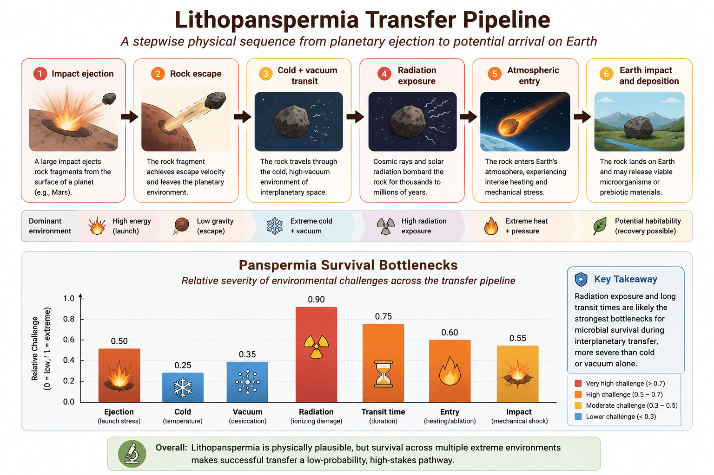

# Panspermia and Lithopanspermia

## Chapter Overview

This chapter examines panspermia and lithopanspermia theories, which propose that life—or at least important prebiotic materials—may have originated elsewhere in space and later arrived on Earth through natural interplanetary transfer processes.

Unlike most abiogenesis theories, panspermia does not primarily explain how life first emerged. Instead, it focuses on whether microorganisms or prebiotic compounds could survive transfer between planetary bodies.

This chapter evaluates the physical plausibility of interplanetary transfer, microbial survival under extreme conditions, and the limitations of panspermia as a complete explanation for the origin of life.

## Core Idea

Panspermia proposes that life, microorganisms, or prebiotic organic compounds may have been transferred to Earth from elsewhere in the Solar System or beyond.

Several forms of panspermia have been proposed:

- **Radiopanspermia** — transport through radiation pressure
- **Lithopanspermia** — transfer within rocks ejected by impacts
- **Directed panspermia** — intentional seeding by intelligent life
- **Cometary panspermia** — delivery through comets or icy bodies

Among these, lithopanspermia is generally considered the most scientifically plausible because meteorite exchange between planets is known to occur naturally.

## Key Terms

- Panspermia
- Lithopanspermia
- Meteorite transfer
- Impact ejection
- Microbial dormancy
- Radiation shielding
- Interplanetary transfer
- Extremophiles

## Historical Context

The idea that life may travel through space has ancient philosophical roots, but the modern scientific form of panspermia is commonly associated with Svante Arrhenius in the early twentieth century [@arrhenius1908].

Later developments expanded the concept considerably. Francis Crick and Leslie Orgel proposed directed panspermia in the 1970s, suggesting that intelligent civilizations might intentionally distribute microbial life through space [@crick1973].

Interest in lithopanspermia increased substantially after the discovery that meteorites can naturally travel between planets and that some microorganisms are capable of surviving extreme environmental conditions.

## Mechanistic Basis

Lithopanspermia treats panspermia as a sequence of physical survival stages rather than a single event.

The proposed transfer process includes:

1. Impact ejection from a planetary surface
2. Escape of rock fragments into space
3. Transit through cold vacuum conditions
4. Exposure to cosmic radiation
5. Atmospheric entry and heating
6. Potential deposition into a habitable environment

Figure \@ref(fig:panspermia-pipeline) summarizes both the transfer sequence and the major environmental bottlenecks associated with lithopanspermia.

```{r panspermia-pipeline, echo=FALSE, out.width='100%', fig.cap='Integrated conceptual model of lithopanspermia showing the transfer sequence from planetary ejection to Earth arrival, along with the major environmental bottlenecks affecting microbial survival.'}

```

The upper portion of the figure illustrates the physical transfer pathway from planetary impact ejection to eventual arrival on Earth. The lower portion evaluates the relative severity of the environmental stresses encountered during this process.

Radiation exposure and long transit durations appear to represent the strongest survival bottlenecks, whereas cold alone may be less destructive for dormant microorganisms.

The figure also highlights an important conceptual distinction: panspermia primarily addresses the **transfer and survival** of life rather than the original emergence of life itself.

## What the Theory Explains Well

Panspermia theories are strongest at explaining:

- Interplanetary transfer of material
- Possible dispersal of microorganisms
- Distribution of organic compounds
- Survival under extreme conditions
- Potential continuity between planetary environments

The theory also provides a plausible explanation for why organic molecules are widespread throughout the Solar System.

## What Makes It Plausible

Several observations support the plausibility of lithopanspermia:

- Meteorites from Mars have been found on Earth
- Planetary impact ejecta are physically real
- Organic molecules exist in meteorites and comets
- Some microorganisms survive extreme radiation and vacuum
- Dormant spores can remain viable for long periods

Laboratory studies demonstrate that certain extremophiles can tolerate conditions resembling portions of interplanetary space.

## Key Experimental and Observational Support

Important supporting evidence includes:

- Discovery of Martian meteorites on Earth
- Detection of amino acids in carbonaceous meteorites
- Survival experiments involving bacterial spores
- Space-exposure experiments on microorganisms
- Observations of extremophiles in harsh terrestrial environments

Some microbial species have survived:

- Vacuum exposure
- High radiation doses
- Extreme cold
- Desiccation
- Extended dormancy

These findings significantly strengthened scientific interest in lithopanspermia as a physically plausible transport mechanism.

## Relationship to Other Origin-of-Life Theories

Panspermia differs fundamentally from most origin-of-life theories because it primarily addresses transfer rather than origin.

However, it can still interact with other theories:

- Primordial soup chemistry may occur on the source planet
- Hydrothermal vent systems may support transferred organisms
- RNA-world chemistry may still be required after transfer
- Protocell and lipid-world mechanisms remain relevant

For this reason, panspermia is often treated as complementary rather than competitive with abiogenesis theories.

## Systems Perspective

Within the broader comparative framework of this book, panspermia shifts the location of prebiotic evolution rather than eliminating the need for abiogenesis.

Even if life arrived from elsewhere, the original emergence of hereditary and evolving systems must still have occurred under suitable environmental conditions at some earlier location.

Thus, panspermia may help explain:

- Distribution of life
- Spread of organics
- Interplanetary biological exchange

but it does not independently explain the original emergence of heredity, metabolism, or Darwinian evolution.

## Major Gaps and Critiques

The principal criticism of panspermia is that it relocates rather than solves the origin-of-life problem.

Major unresolved questions include:

- Where did life originally emerge?
- How likely is long-term survival during transit?
- Can microorganisms survive millions of years in space?
- How common are successful transfer pathways?

Directed panspermia introduces additional scientific and philosophical complications because it requires pre-existing intelligent life elsewhere.

## Current Scientific Standing

Panspermia remains scientifically plausible as a transfer hypothesis, particularly in its lithopanspermia form.

However, it is generally not treated as a complete explanation for abiogenesis because it does not explain how life originally emerged.

Most modern researchers therefore view panspermia as:

- A plausible secondary mechanism
- Potentially important for planetary exchange
- Relevant to astrobiology
- Complementary to abiogenesis theories rather than a replacement for them

## Comparative Assessment

| Dimension | Assessment |
|---|---|
| Primary Contribution | Interplanetary transfer and survival |
| Explanatory Strength | Strong for transfer, weak for origin |
| Mechanistic Plausibility | Moderate |
| Experimental Support | Moderate |
| Environmental Realism | Moderate |
| Main Limitation | Does not explain original abiogenesis |
| Integrative Potential | Moderate-High |
| Current Scientific Standing | Plausible but secondary |

## Performance Across Major Abiogenesis Challenges

Table \@ref(tab:panspermia-performance) summarizes how panspermia theories perform across major origin-of-life transitions.

```{r panspermia-performance, echo=FALSE}
knitr::kable(
  data.frame(
    Challenge = c(
      "Abiotic synthesis",
      "Organic transfer",
      "Molecular survival",
      "Catalysis",
      "Compartment formation",
      "Information storage",
      "Hereditary replication",
      "Darwinian evolution"
    ),
    Performance = c(
      "Weak",
      "Strong",
      "Moderate-Strong",
      "Weak",
      "Weak",
      "Weak",
      "Weak",
      "Limited"
    )
  ),
  caption = "Comparative performance of Panspermia and Lithopanspermia theories across major abiogenesis challenges."
)
```

Panspermia performs strongly as a transport and survival framework, but weakly as a standalone explanation for the original emergence of life.