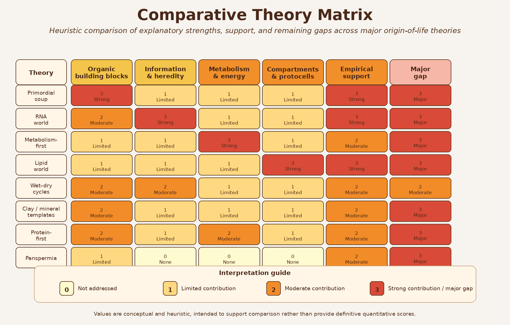

# Comparative Synthesis

## Chapter Overview

No single origin-of-life theory currently explains all major transitions required for the emergence of living systems. Instead, modern origin-of-life research increasingly suggests that different theories may explain different stages of a broader transition from geochemistry to biology.

This final chapter synthesizes the major theories discussed throughout the book and compares their explanatory strengths, mechanistic focus, empirical support, and remaining limitations.

Rather than treating the theories as entirely competing alternatives, this comparative framework evaluates how they may interact within broader hybrid or sequential models of abiogenesis.

## Integrative Perspective

The origin of life likely required multiple major transitions occurring across different physical and chemical environments. These transitions include:

1. Abiotic synthesis of organic molecules
2. Molecular concentration and organization
3. Polymerization and catalytic complexity
4. Emergence of information storage and replication
5. Formation of compartments and protocells
6. Development of energy transduction systems
7. Transition to Darwinian evolution

Different theories appear strongest at explaining different portions of this sequence.

For example:

- Primordial soup models explain organic precursor synthesis
- Wet–dry cycles and clay surfaces support polymerization
- RNA World addresses heredity and replication
- Metabolism-first models explain energy flow and catalytic organization
- Lipid-world theories explain compartment formation
- Panspermia addresses interplanetary transfer and survival

This broader systems perspective suggests that abiogenesis may not have followed a single isolated pathway.

## Comparative Framework

Throughout this book, each theory has been evaluated using several recurring criteria:

- Explanatory scope
- Mechanistic plausibility
- Experimental support
- Environmental realism
- Integration with other models
- Remaining scientific gaps
- Capacity to support Darwinian evolution

Figure \@ref(fig:comparative-matrix) summarizes how the major theories compare across key origin-of-life problem domains.

```{r comparative-matrix, echo=FALSE, out.width='100%', fig.cap='Comparative matrix showing how major origin-of-life theories address different stages and challenges in the transition from chemistry to early life.'}

```

The figure illustrates an important conclusion emerging from modern origin-of-life research: most theories are strongest within a limited explanatory domain rather than across the entire origin sequence.

For example:

- **Primordial soup** performs strongly in abiotic synthesis but weakly in heredity
- **RNA World** is powerful for information storage and replication but weaker for prebiotic accessibility
- **Metabolism-first theories** explain energy flow and catalytic continuity but not encoded heredity
- **Lipid-world theories** solve compartmentalization problems but not replication
- **Clay/mineral models** support molecular organization and templating
- **Wet–dry cycle theories** explain concentration and polymerization dynamics
- **Protein-first models** emphasize primitive catalysis
- **Panspermia** addresses transfer rather than original emergence

This comparative structure reinforces the broader conclusion that no current theory independently explains all major abiogenesis transitions.

## Empirical Support and Explanatory Scope

Theories differ not only in what they explain, but also in the degree of empirical support available for their central mechanisms.

Figure \@ref(fig:evidence-scope) compares major theories according to two broad dimensions:

1. Relative empirical support
2. Relative explanatory scope

```{r evidence-scope, echo=FALSE, out.width='90%', fig.cap='Conceptual comparison of relative empirical support and explanatory scope among major origin-of-life theories.'}
knitr::include_graphics("figures/12_evidence_vs_scope_matrix.png")
```

The figure highlights several important patterns:

- Some theories possess strong empirical support but narrow explanatory scope
- Others provide broad conceptual frameworks but remain experimentally difficult to validate
- Several theories occupy complementary rather than competing positions

For example:

- Primordial soup chemistry has substantial experimental support
- RNA catalysis is strongly supported experimentally
- Hydrothermal vent models are geochemically plausible
- Lipid vesicle self-assembly is experimentally reproducible
- Panspermia is physically plausible but does not address abiogenesis itself

At the same time, major unresolved problems remain across all theories, particularly regarding:

- Transition from chemistry to heredity
- Emergence of encoded information
- Origin of self-sustaining replication
- Integration of metabolism with compartments
- Transition to Darwinian evolution

## Hybrid and Sequential Models

Increasingly, modern research favors hybrid or sequential models that combine mechanisms from multiple theories.

Possible integrated scenarios include:

- Primordial synthesis of organics in atmospheric or hydrothermal settings
- Concentration through evaporation, mineral surfaces, or porous vents
- Polymerization assisted by wet–dry cycles or mineral templating
- Emergence of catalytic RNA or peptide networks
- Encapsulation within lipid vesicles
- Coupling of metabolism, heredity, and compartmentalization
- Gradual transition to cellular evolution

Under this view, different theories may describe different stages within a larger evolutionary continuum.

Rather than asking which theory is entirely correct, current research increasingly asks:

> Which combinations of mechanisms could realistically cooperate under early Earth conditions?

This systems-level perspective represents a major shift in modern origin-of-life research.

## Remaining Grand Challenges

Despite major advances, several fundamental questions remain unresolved.

### 1. Origin of Heredity

No theory fully explains how stable, self-replicating informational systems first emerged under realistic prebiotic conditions.

### 2. Integration Problem

Individual components of life—metabolism, heredity, and compartments—must ultimately become integrated into unified evolving systems.

### 3. Environmental Uncertainty

The precise environmental conditions of early Earth remain incompletely understood, including:

- Atmospheric composition
- Ocean chemistry
- Temperature regimes
- Availability of catalytic minerals
- Stability of surface environments

### 4. Transition to Darwinian Evolution

A major unresolved challenge is understanding how non-living chemistry crossed the threshold into open-ended biological evolution.

## Broader Scientific Importance

Origin-of-life research extends beyond explaining early Earth alone.

The field also informs:

- Astrobiology
- Exoplanet habitability
- Planetary evolution
- Systems chemistry
- Synthetic biology
- Search for extraterrestrial life

Understanding abiogenesis may therefore help answer broader questions concerning:

- Whether life is rare or common in the universe
- Which planetary environments are potentially habitable
- How biological complexity emerges from chemistry

## Limitations of Comparative Framing

The comparative figures presented in this chapter are conceptual rather than strictly quantitative.

Their rankings are heuristic and intended to support structured scientific comparison rather than definitive scoring.

Several important limitations should be acknowledged:

- Empirical support varies across subdomains
- Some theories remain highly speculative
- New experimental discoveries may substantially alter current interpretations
- Theories overlap and interact in complex ways
- Abiogenesis may not follow a single universal pathway

Accordingly, the figures should be interpreted as conceptual synthesis tools rather than final scientific conclusions.

## Final Perspective

The origin of life remains one of the most difficult and interdisciplinary problems in science.

Current evidence suggests that no single theory completely explains the transition from abiotic chemistry to evolving cellular life. Instead, the emergence of life likely involved multiple interacting processes operating across different environments and timescales.

Theories once viewed as competing alternatives increasingly appear capable of contributing complementary pieces to a larger systems-level explanation.

In this sense, the origin of life may ultimately be understood not as a single event, but as a progressive transition from geochemistry to biological complexity through the interaction of many partially understood mechanisms.