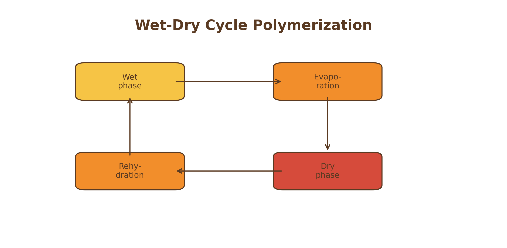

# Warm Little Pond and Wet-Dry Cycle Theories

## Core Idea

This theory proposes a distinct mechanistic route to early prebiotic organization [@deamer2012].

## Historical Context

This framework emerged as an attempt to solve a specific weakness in earlier origin-of-life models.

## Mechanistic Basis

Its central mechanism is summarized in Figure \@ref(fig:warm).

(\#fig:warm)Conceptual schematic for Warm Little Pond and Wet-Dry Cycle Theories.

The figure highlights the core physical mechanism emphasized by this theory.

## What the Theory Explains Well

Strong for concentration and polymerization, weaker for stability.

## What Makes It Plausible

Experimental and conceptual work supports the plausibility of the core mechanism.

## Key Experimental / Observational Support

Modern experimental work provides partial support for the mechanism [@deamer2012].

## Major Gaps and Critiques

The principal gap is that this theory explains one major transition well, but not the full origin sequence.

## Current Scientific Standing

This theory remains influential as part of hybrid origin-of-life models and is rarely treated as a complete standalone explanation.

| Dimension | Assessment |
|---|---|
| Strength | Strong in its primary domain |
| Plausibility | Moderate |
| Main Gap | Incomplete integration |
| Current Standing | Influential but partial |
