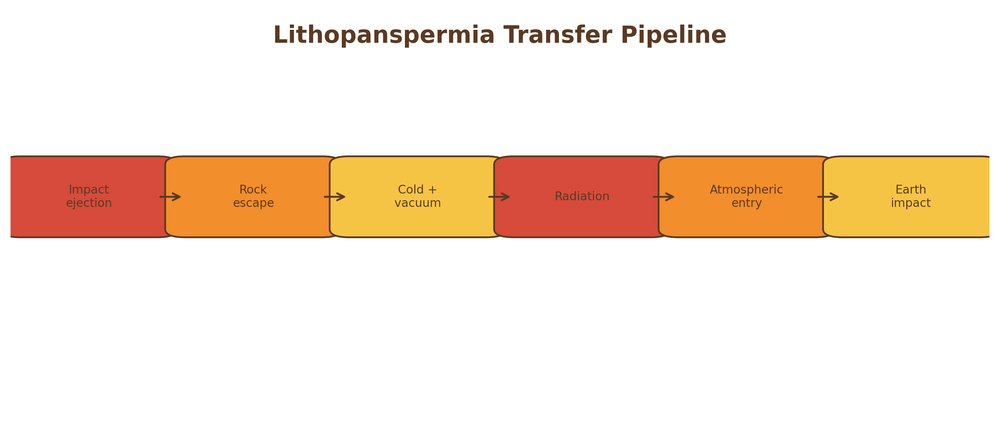
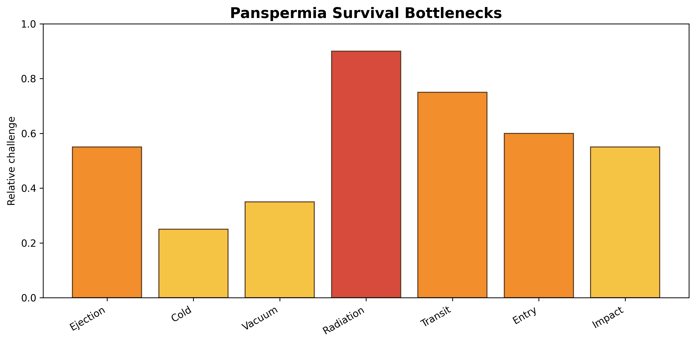

# Panspermia and Lithopanspermia

## Core Idea

Panspermia proposes that life or prebiotic material may have been transferred to Earth from elsewhere.

## Historical Context

The modern scientific history of panspermia traces to Arrhenius [@arrhenius1908], with later variants including directed panspermia [@crick1973].

## Mechanistic Basis

Lithopanspermia treats panspermia as a stage-based survival problem.

(\#fig:panspermia-pipeline)Lithopanspermia transfer pipeline from impact ejection to Earth arrival.

This figure reframes panspermia as a testable physical sequence.

(\#fig:panspermia-bottlenecks)Relative survival challenges in lithopanspermia. Radiation and long transit time are likely stronger bottlenecks than cold alone.

The figure shows why radiation is the dominant constraint.

## What the Theory Explains Well

Panspermia explains possible transfer, not origin.

## What Makes It Plausible

Mars-Earth transfer, microbial dormancy, and rock shielding make lithopanspermia physically plausible.

## Key Experimental / Observational Support

Meteorite transfer and microbial survival studies support partial plausibility.

## Major Gaps and Critiques

It relocates rather than solves the origin problem.

## Current Scientific Standing

Panspermia remains plausible but secondary: scientifically serious as a transfer hypothesis, incomplete as an origin theory.

| Dimension | Assessment |
|---|---|
| Strength | Transfer |
| Plausibility | Moderate |
| Main Gap | Does not explain origin |
| Current Standing | Plausible but secondary |
