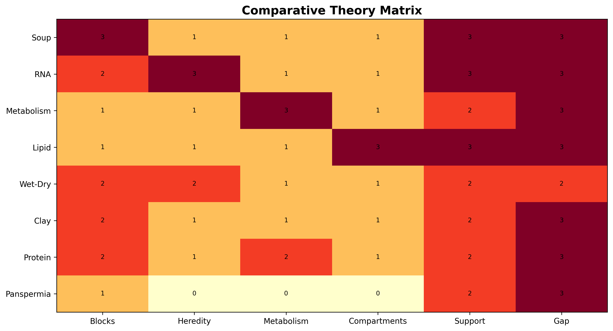
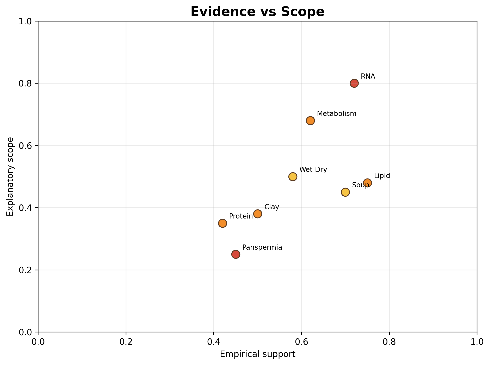

# Comparative Synthesis

Figure \@ref(fig:comparative-matrix) compares explanatory strengths and weaknesses across the major theories.

(\#fig:comparative-matrix)Comparative matrix of major theories across key origin-of-life problem areas.

Figure \@ref(fig:evidence-scope) compares empirical support and explanatory scope.

(\#fig:evidence-scope)Conceptual comparison of relative empirical support and explanatory scope among major origin-of-life theories.

## Limitations of Comparative Framing

These figures are conceptual rather than strictly quantitative. Their rankings are heuristic and intended to support structured comparison rather than definitive scoring. Empirical support varies substantially by subdomain, and the figures necessarily simplify active scientific debates.
