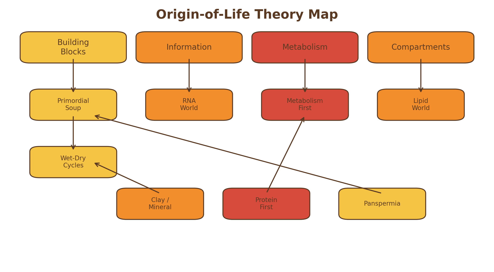

# Preface {-}

This book evaluates the major scientific theories proposed to explain the origin of life. Its central argument is that origin-of-life theories are best understood as partial explanatory frameworks rather than complete and mutually exclusive solutions.

Figure \@ref(fig:theory-map) provides the conceptual framework for the book by mapping each theory to the scientific domain it addresses most directly.

```{r theory-map, echo=FALSE, out.width='100%', fig.cap='Conceptual map of major origin-of-life theories and their primary explanatory domains.'}

```

The figure establishes the analytical framework used throughout this book: theories are evaluated not by whether they solve the entire origin problem alone, but by which parts they explain most plausibly and rigorously.
